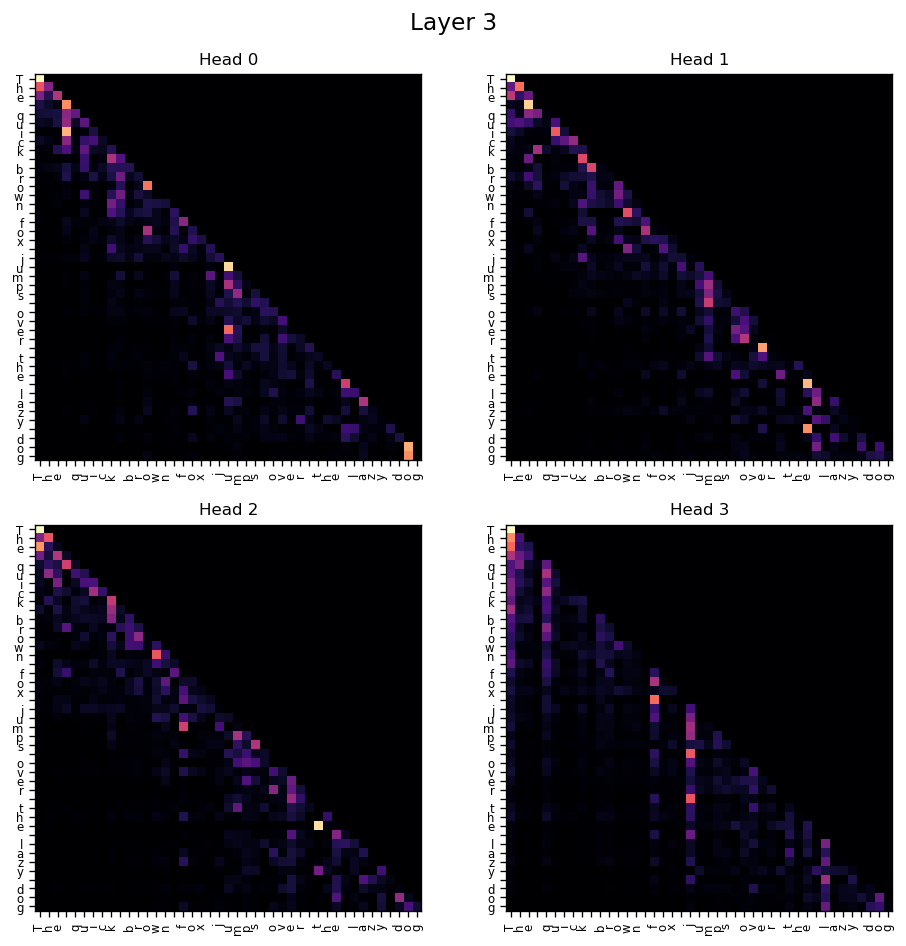
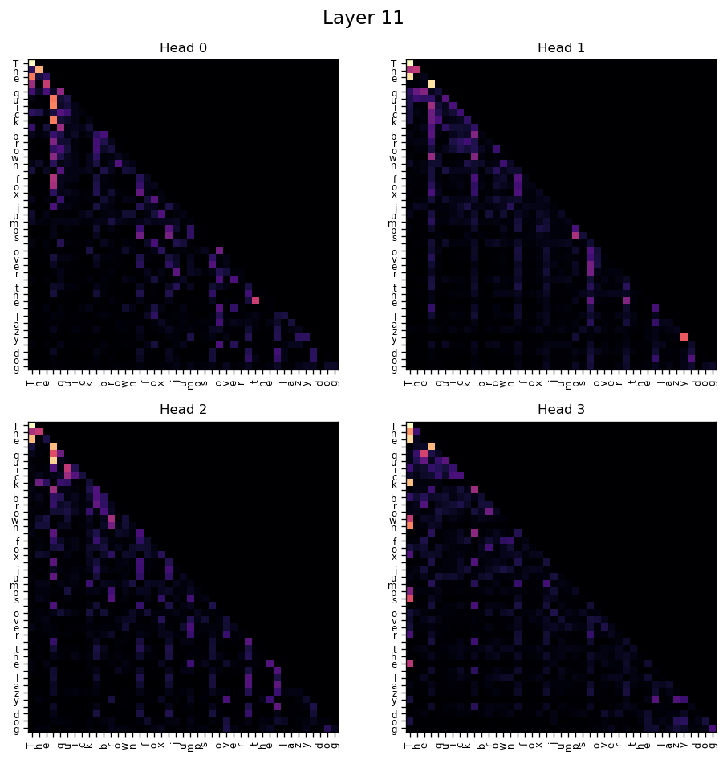
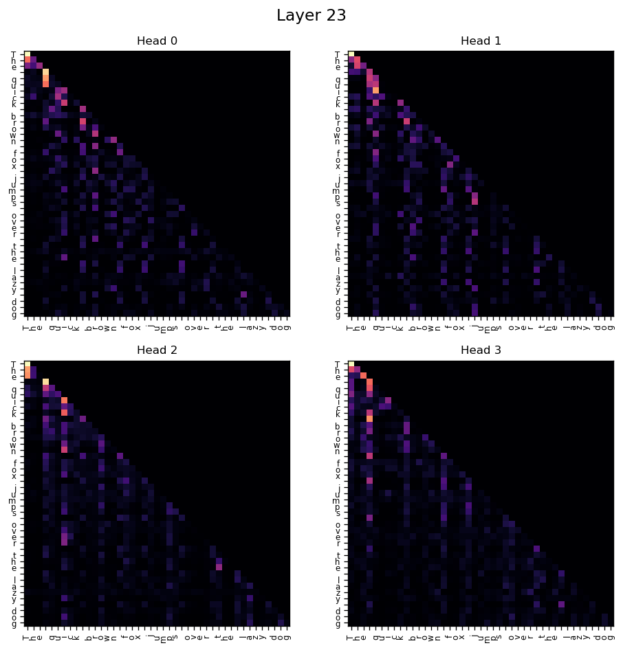
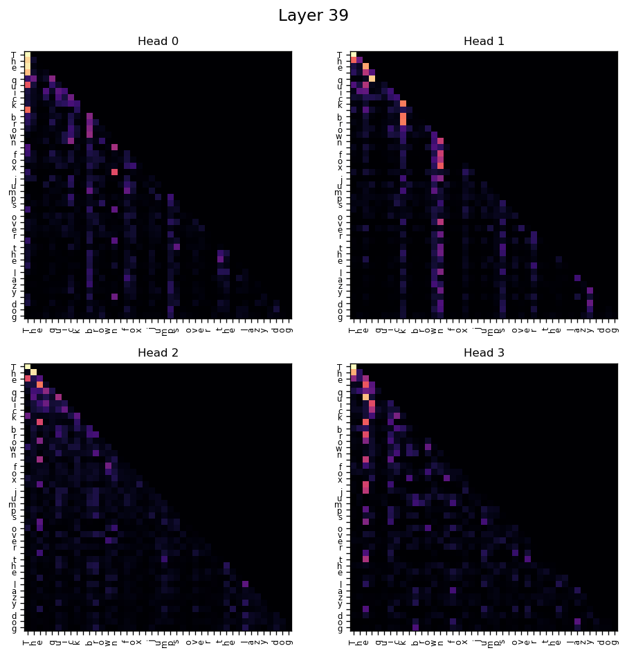
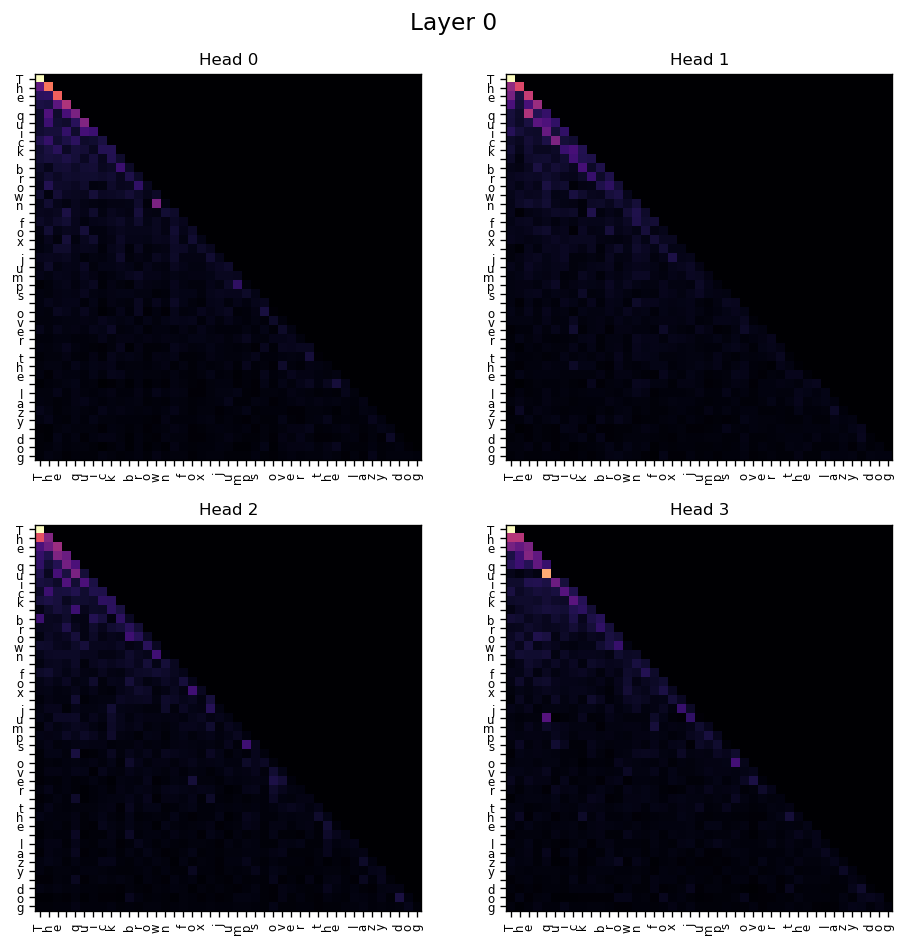
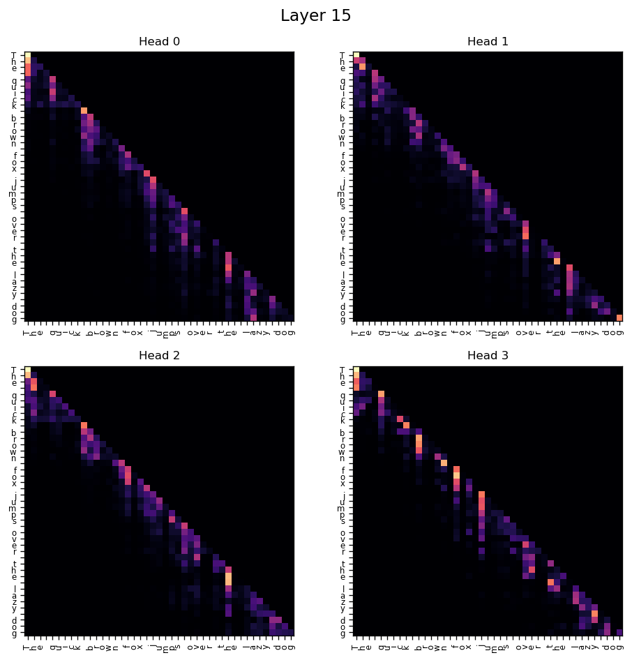
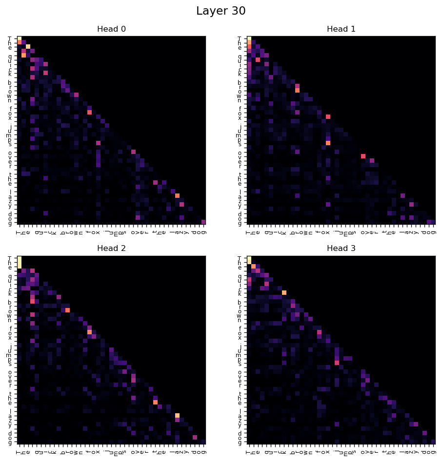

# E2. Attention Visualization

## Experimental Setup

| Component | Details                                                             |
| --------- | ------------------------------------------------------------------- |
| Dataset   | `shakespeare.txt` from `ai_playground/data/datasets/text_datasets/` |
| Model     | MiniGPT-style transformer                                           |
| Base Config|  [gpt_config.yaml](../../src/ai_playground/configs/gpt_config.yaml)
| Prompt    | `"The quick brown fox jumps over the lazy dog"`                     |

> **Objective:** Visualize how attention patterns evolve across layers and heads in a trained Transformer model.

---

## Steps to reproduce the results

From the experiment folder:

```bash
python -u attention_visualization.py
```

---

**Parameters overridden for the experiment:**

- depth: `model.model_kwargs.n_layer`

Depth sweep used for visualization:

```
[4, 12, 24, 40]
```

Each model is trained briefly and attention maps are extracted after training.

---

## E2.1 Depth Scaling — Attention Maps

This section compares attention behavior across models with different numbers of layers.

---

### 4 Layer Model

<figure align="center">
  
  <figcaption><em>Figure 2.1.1 - Validation loss vs embedding dimension (n_embed).</em></figcaption>
</figure>

**Observation**

- Diagonal structures dominate the attention maps.
- Attention heads primarily focus on **local token relationships**.
- Limited depth constrains hierarchical representation learning.

---

### 12 Layer Model

<figure align="center">
  
  <figcaption><em>Figure 2.1.2 - Validation loss vs embedding dimension (n_embed).</em></figcaption>
</figure>

**Observation**

- Attention patterns become more structured.
- Some heads begin attending to **longer-range dependencies**.
- Emerging specialization among heads appears.

---

### 24 Layer Model

<figure align="center">
  
  <figcaption><em>Figure 2.1.3 - Validation loss vs embedding dimension (n_embed).</em></figcaption>
</figure>

**Observation**

- Long-range token interactions become more visible.
- More heads capture **broader context**.
- Multiple attention strategies begin coexisting across heads.

---

### 40 Layer Model

<figure align="center">
  
  <figcaption><em>Figure 2.1.4 - Validation loss vs embedding dimension (n_embed).</em></figcaption>
</figure>

**Observation**

- Clear specialization between heads emerges.
- Some heads act as **global context aggregators**.
- Others maintain **local syntactic tracking**.

---

## E2.2 Attention Evolution Inside a Deep Transformer

To analyze how attention evolves through depth, we inspect representative layers from the **40-layer model**.

---

### Early Layer

<figure align="center">
  
  <figcaption><em>Figure 2.2.1 - Validation loss vs embedding dimension (n_embed).</em></figcaption>
</figure>

**Observation**

- Attention is mostly **local**.
- Tokens attend strongly to nearby tokens.
- Diagonal attention patterns dominate.

---

### Middle Layer

<figure align="center">
  
  <figcaption><em>Figure 2.2.2 - Validation loss vs embedding dimension (n_embed).</em></figcaption>
</figure>

**Observation**

- Attention spreads across a larger portion of the sequence.
- Some heads begin capturing **semantic grouping patterns**.
- Context integration becomes more visible.

---

### Late Layer

<figure align="center">
  
  <figcaption><em>Figure 2.2.3 - Validation loss vs embedding dimension (n_embed).</em></figcaption>
</figure>

**Observation**

- Long-range dependencies become clearer.
- Some tokens receive attention from many positions.
- Heads demonstrate stronger functional specialization.

---

### Final Layer

<figure align="center">
  
  <figcaption><em>Figure 2.2.4 - Validation loss vs embedding dimension (n_embed).</em></figcaption>
</figure>

**Observation**

- Highly structured attention patterns emerge.
- Some heads focus on **global context aggregation**.
- Final-layer representations integrate signals from earlier layers.

---

## Key Takeaways

- Early layers tend to capture **local token relationships**.
- Deeper layers progressively integrate **long-range context**.
- Attention heads exhibit **functional specialization** as model depth increases.
- Transformer depth plays a major role in forming hierarchical contextual representations.

> **Note:** Complete attention visualizations for all layers and heads are available in the repository:  
> [.assets folder](.assets/)
