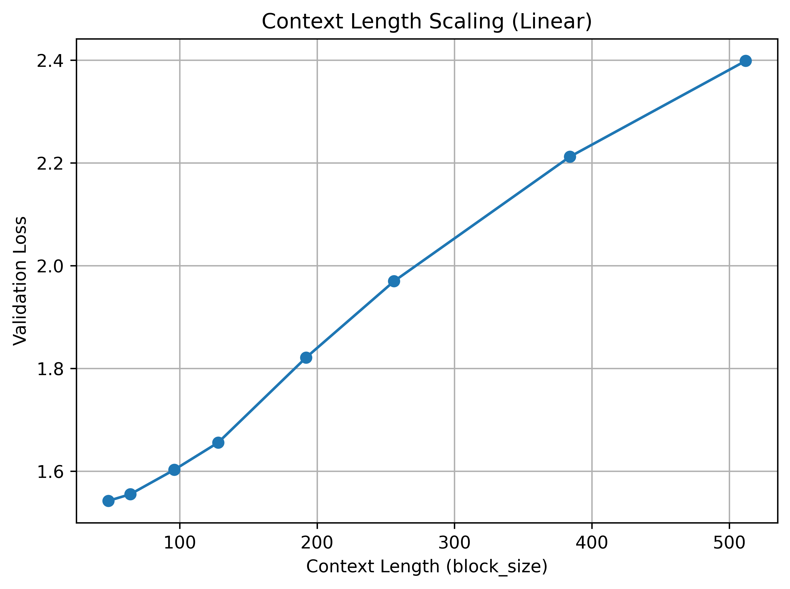

# Experiment 3: Effect of Context Length Scaling on Validation Loss

## Experimental Setup

| Component | Details                                                             |
| --------- | ------------------------------------------------------------------- |
| Dataset   | `shakespeare.txt` from `ai_playground/data/datasets/text_datasets/` |
| Model     | MiniGPT-style transformer                                           |
| Base Config|  [gpt_config.yaml](../../src/ai_playground/configs/gpt_config.yaml)

> **Objective:** Study how increasing the maximum context length (sequence length) affects validation loss.

---

## Steps to reproduce the results

From the experiment folder:

```bash
python -u context_length_scaling.py
```

---

**Parameters overridden for the experiment:**

- context length: `model.model_kwargs.block_size`

Context lengths used for the sweep:

```
[48, 64, 96, 128, 192, 256, 384, 512]
```

> **Note**: For given dataset size, training was unstable for context length <= 32 for training steps > 4k. During that training period, for iso-steps, validation loss decreases sharply till context length is 32 and then increases beyond that. However, due to NaNs in training beyond that point, those results are not included here.

---

## E3.1. Context Length vs Validation Loss

<figure align="center">
  
  <figcaption><em>Figure 3.1 - Validation loss vs context length.</em></figcaption>
</figure>

---

### Observation

Validation loss increases roughly linearly with context length.

- Longer contexts are intrinsically harder to model.
- Increasing context length increases the intrinsic dimension of the conditional distribution the model must approximate, while model capacity is fixed.

According to [Shi et al., 2025](https://arxiv.org/html/2502.01481v2), the cross-entropy can be decomposed as:

> Cross Entropy Loss(𝐿) ≈ Bayes Risk(𝐿)+ Approximation Loss(𝐿)

- Bayes risk decreases with context length (more information).
- Approximation loss increases with context length (harder to approximate).

Fixed training data and model size limit effective learning.
Even though total tokens are constant, the model cannot fully leverage longer contexts, resulting in higher validation loss.
