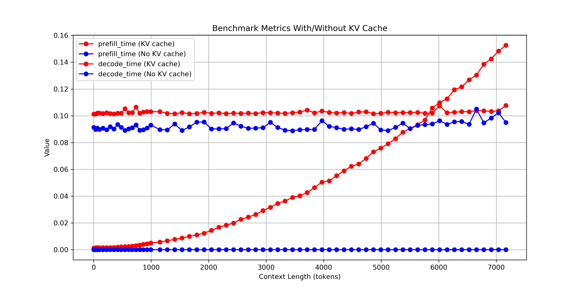
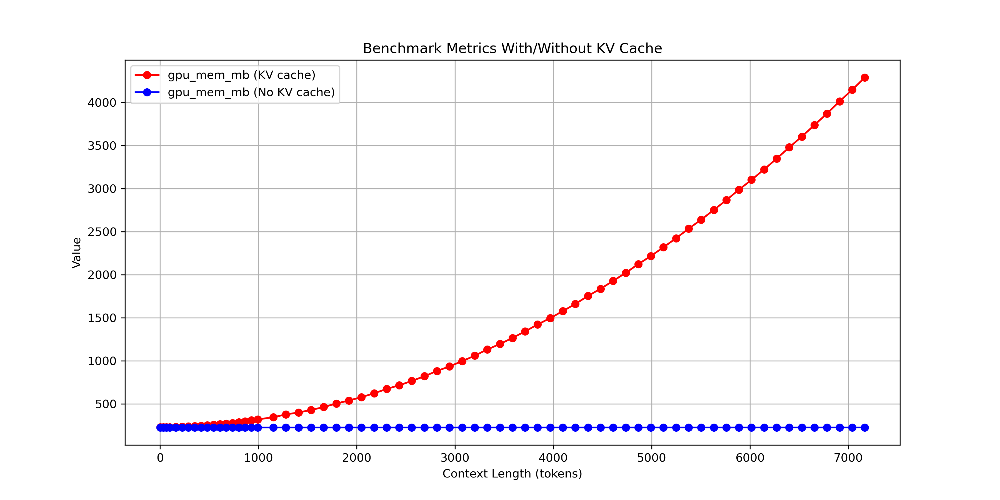

# Experiment 5: Prefill and Decode Times with/without KV Cache

## Experimental Setup

| Component   | Details                                                            |
| ----------- | ------------------------------------------------------------------ |
| Dataset     | Synthetic / generated sequences for timing measurement             |
| Model       | MiniGPT-style transformer                                          |
| Base Config | [gpt_config.yaml](../../src/ai_playground/configs/gpt_config.yaml) |

> **Objective:** Measure how **prefill and decode times** scale with context length, comparing **KV cache enabled vs disabled**, and observe memory and computation behavior.

---

## Steps to Reproduce

From the experiment folder:

```bash
python -u kv_prefill_vs_decode.py
```

**Parameters overridden for the experiment:**

- max context length = 7168
- batch size = 4
- Persistent KV Cache

**Runs performed:**

- KV cache enabled (prefill + decode)
- KV cache disabled

> Note: Largest context run first to avoid spikes in results due to multiple GPU memory allocations.

## E5.1 Prefill and Decode Times vs Context Length

<figure align="center">
  
  <figcaption><em>Figure 5.1 - Prefill and decode times across different context lengths, with and without KV cache.</em></figcaption>
</figure>

<figure align="center">
  
  <figcaption><em>Figure 5.2 - GPU memory consumption, with and without KV cache.</em></figcaption>
</figure>

## Observations

### Prefill vs Decode

- **Prefill with KV cache** grows quadratically `(O(n²))` with context length, reflecting full attention computation for all past tokens.
- **Decode with KV cache** is effectively constant in this small model because compute is tiny and memory/kernel overhead dominates. On larger models, it would scale linearly `(O(n))` as each new token only attends over cached KV pairs.

### KV vs No KV

- Without KV cache, **prefill is irrelevant**, since no cache is allocated.
- **Decode without KV cache** is slightly faster than decode with KV for this small model because compute is tiny and KV memory overhead dominates. However difference between the two gets smaller for larger contexts.

### Memory Allocation Effects

- Running the **largest context first** ensures CUDA allocates maximum required memory upfront, avoiding multiple memory allocs per run, smoothing prefill timings and removing spikes.
- **Persistent KV cache** avoids repeated memory allocation overhead.
- For **small models on limited GPU memory**, KV cache is mostly a memory tradeoff rather than a compute optimization.
- For **larger models**, KV cache will become critical to reduce decode time despite memory overhead.
