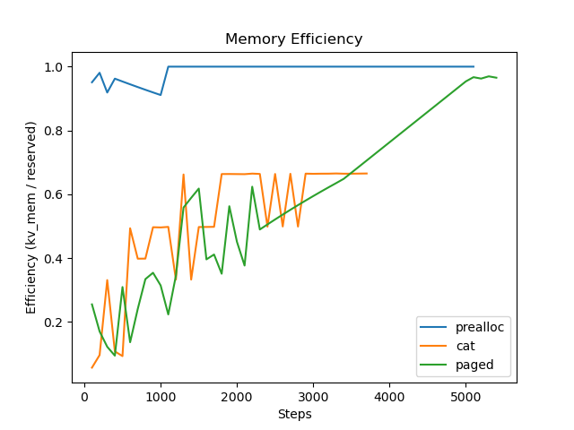
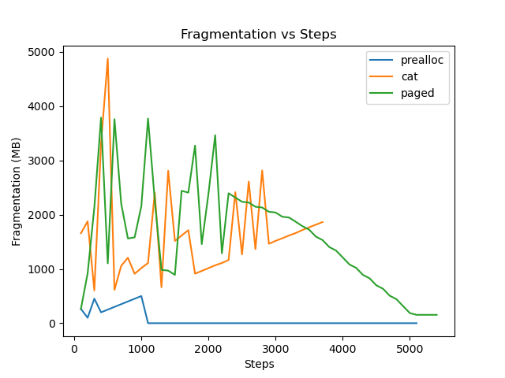

# Experiment 7: KV Cache Allocation — Efficiency vs Capacity

## Experimental Setup

| Component  | Details                                              |
| ---------- | ---------------------------------------------------- |
| Simulation | Autoregressive KV cache growth (token-by-token)      |
| Data       | Synthetic KV tensors                                 |
| Strategies | Naive (`torch.cat`), Preallocated, Paged KV          |
| Stressors  | Memory prefill, transient attention-like allocations |

---

> **Objective:** Understand the tradeoff between:

- Memory efficiency
- Effective capacity (steps survived)
- Allocator behavior under stress

---

## Steps to Reproduce

From the experiment folder:

```bash
python -u kv_cache_impl_stress.py
```

**Additional stress applied:**

- GPU memory prefilled
- Large temporary tensors: attention-like simulation

## Results

<figure align="center">
  
  <figcaption><em>Figure 7.1 - Memory Efficiency vs steps.</em></figcaption>
</figure>

<figure align="center">
  
  <figcaption><em>Figure 7.1 - Memory fragmentation vs steps.</em></figcaption>
</figure>

| Strategy | Efficiency       | Steps Survived | Behavior                                                                                                         |
| -------- | ---------------- | -------------- | ---------------------------------------------------------------------------------------------------------------- |
| Prealloc | Highest (~1.0)   | High           | Fixed capacity, very stable. Fails when seq len overflows cache memory, or trying to allocate over memory limit. |
| Paged    | Moderate to High | Highest        | Adapts, fragmentation stabilizes. Fails at memory limit                                                          |
| Cat      | Low / unstable   | Lowest         | Fragmentation-driven failure                                                                                     |

---

## Observations

### 🔹 Prealloc: Highest Efficiency

- `alloc ≈ reserved`
- Minimal fragmentation
- Efficiency remains near **1.0**
- Fails at **fixed capacity limit**
- Cannot grow beyond preallocated size
- Use Prealloc when:
  - Max sequence length is known
  - Stability and latency matter
  - Production inference systems

> Perfect memory utilization, but inflexible

---

### 🔹 Paged KV: Best Effective Capacity

- `kv_mem` grows linearly
- Fragmentation initially high, then stabilizes
- Efficiency improves over time
- Use Paged KV when:
  - Sequence length is dynamic
  - Long-context or unknown workloads
  - Memory fragmentation is a concern

> Slight overhead, but best real-world robustness

---

### 🔹 Cat KV: Worst case

- Fragmentation spikes early
- Reserved memory grows faster than actual usage
- Efficiency drops sharply
- Early OOM
- Poor utilization despite lower `kv_mem`
- Avoid Cat KV:
  - Not suitable for real-world systems
    > Allocator fragmentation dominates, leading to failure
