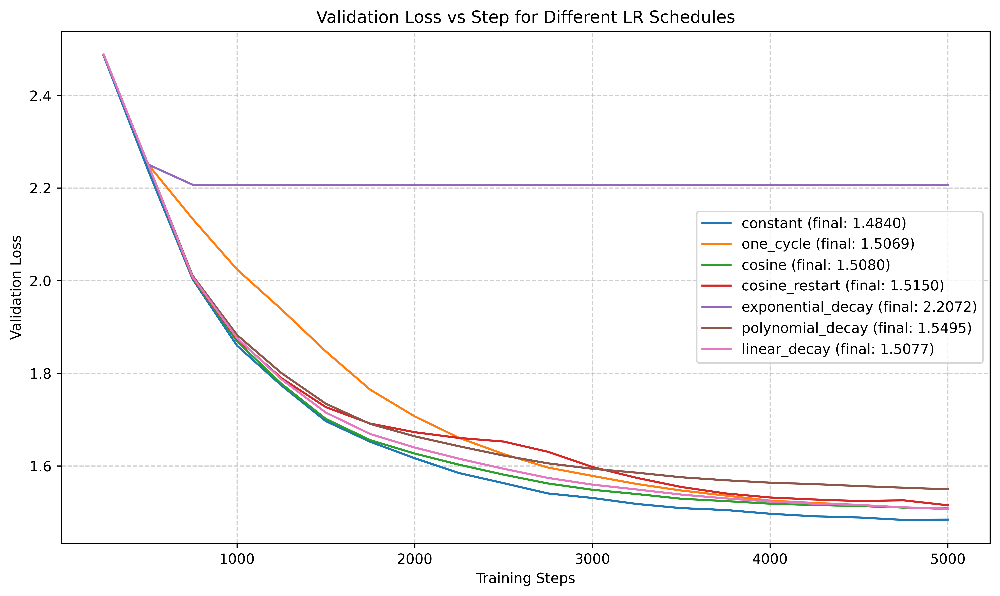

# Experiment 4: Effect of Learning Rate Schedulers on Validation Loss

## Experimental Setup

| Component | Details                                                             |
| --------- | ------------------------------------------------------------------- |
| Dataset   | `shakespeare.txt` from `ai_playground/data/datasets/text_datasets/` |
| Model     | MiniGPT-style transformer                                           |
| Config    | [gpt_config.yaml](../../configs/gpt_config.yaml)                    |

> **Objective:** Study how different learning rate schedulers affect validation loss while keeping all other hyperparameters constant.

---

## Steps to reproduce the results

From the experiment folder:

```bash
python -u lr_schedulers.py
```

---

**Schedulers compared:**

- Constant
- Cosine decay
- Cosine with restarts
- Linear decay
- One-cycle LR
- Polynomial decay
- Exponential decay

## E4.1 Validation Loss vs Scheduler

<figure align="center">  <figcaption><em>Figure 4.1 - Validation loss curves for different learning rate schedulers.</em></figcaption> </figure>

### Expected vs Observed Behavior

| Scheduler         | Expected Behavior                                    | Observed Behavior                                      | Final Validation Loss |
| ----------------- | ---------------------------------------------------- | ------------------------------------------------------ | --------------------- |
| Constant          | Stable, steady convergence                           | Matches expectation. Smooth learning                   | 1.480                 |
| Cosine decay      | Smooth decay. slightly slower than constant          | Matches expectation. slightly slower than constant.    | 1.500                 |
| Cosine restart    | Periodic resets to accelerate convergence            | Loss bump slightly near reset but recovers at end      | 1.515                 |
| Linear decay      | Gradual reduction in LR. smooth improvement          | Matches expectation. Closely follows cosine loss       | 1.500                 |
| One-cycle LR      | Aggressive early changes. fast convergence expected  | Starts poorly, slow initial improvement, recovers late | 1.506                 |
| Polynomial decay  | Smooth polynomial decay. Should track others closely | Tracks others early, but later diverges                | 1.550                 |
| Exponential decay | Exponential reduction. minor slowdowns expected      | Early learning, then flatlines high                    | 2.200                 |

> **Note** These results are constrained by model size and available hardware, and may improve with larger models.
