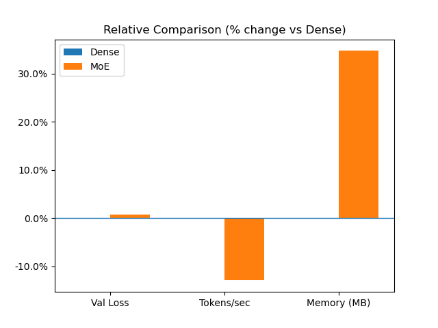
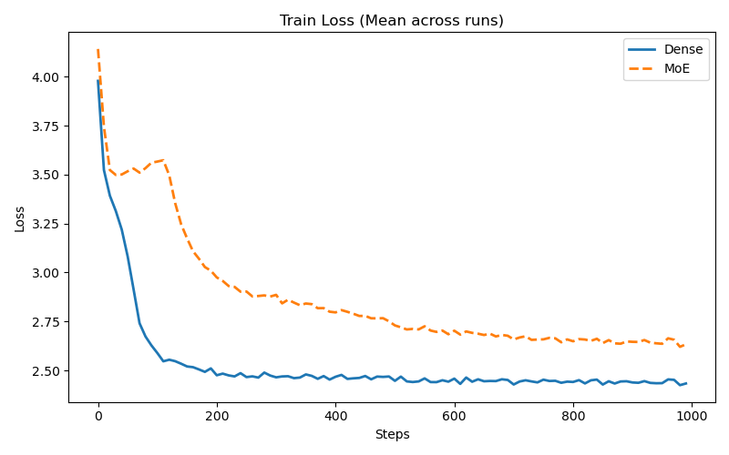
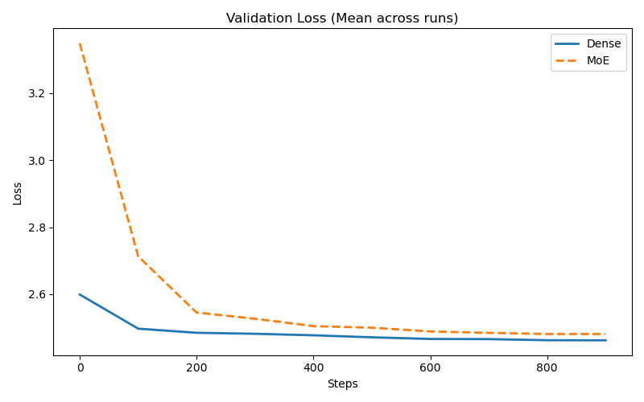

# Experiment 8: Mixture of Experts (MoE) vs Dense FFN models

## Experimental Setup

| Component   | Details                                                             |
| ----------- | ------------------------------------------------------------------- |
| Dataset     | `shakespeare.txt` from `ai_playground/data/datasets/text_datasets/` |
| Model       | MiniGPT-style transformer                                           |
| Base Config | [gpt_config.yaml](../../src/ai_playground/configs/gpt_config.yaml)  |

> **Objective:** Study the pros and cons of Mixture of Experts over a dense transformer model.

We compare:

- Training loss
- Throughput (tokens/sec)
- Memory usage
- Stability across runs

---

**Parameters overridden for the experiment:**

| Model | Hidden Dim | Experts | Notes                |
| ----- | ---------- | ------- | -------------------- |
| Dense | 1024       | 0       | Standard transformer |
| MoE   | 1024       | 4       | Top-k routing (k=2)  |

### Training Setup

- Steps: 1000
- Warmup run used to avoid cold-start bias
- Runs: 2–3 (balanced ordering: dense-first / moe-first)
- Deterministic seeding with variation per run

## Steps to reproduce the results

From the experiment folder:

```bash
python -u moe_vs_dense.py
```

---

## Results

<figure align="center">
  
  <figcaption><em>Figure 8.1 - percentage differnce between MoE and Dense metrics.</em></figcaption>
</figure>

<figure align="center">
  
  <figcaption><em>Figure 8.2 - Training loss for MoE and dense transformer.</em></figcaption>
</figure>

<figure align="center">
  
  <figcaption><em>Figure 8.3 - Validation loss for MoE and dense transformer.</em></figcaption>
</figure>

## Observations

### 1. Dense consistently outperforms MoE in loss

- Validation loss differnce is small (~0.02) but consistent
- MoE is competitive but not superior for a model and data of this size.

---

### 2. MoE shows higher variance

- Both in loss and throughput

---

### 3. MoE is slower

- ~10–25% lower TPS
- routing overhead
- hardware limits

---

### 4. MoE uses more memory

- Expected due to expert parameters

---

## Key Insights

### MoE does not outperform Dense in this regime

Reasons:

- Dataset too simple. Shakespeare does not require strong specialization
- Model too small. Dense model already sufficient, No need for conditional capacity.
- Training duration limited. MoE often benefits from longer training
- Weak specialization signal

---
