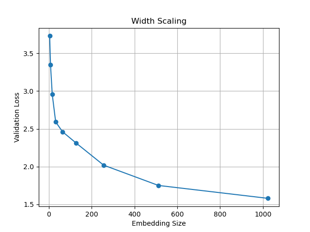
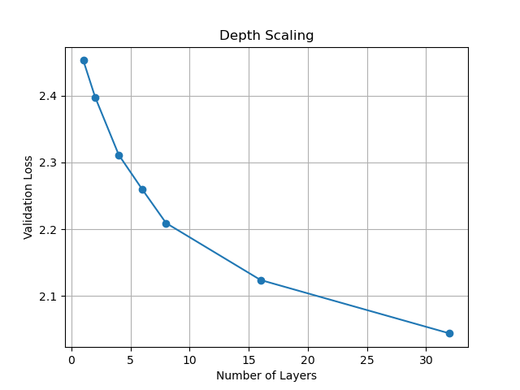
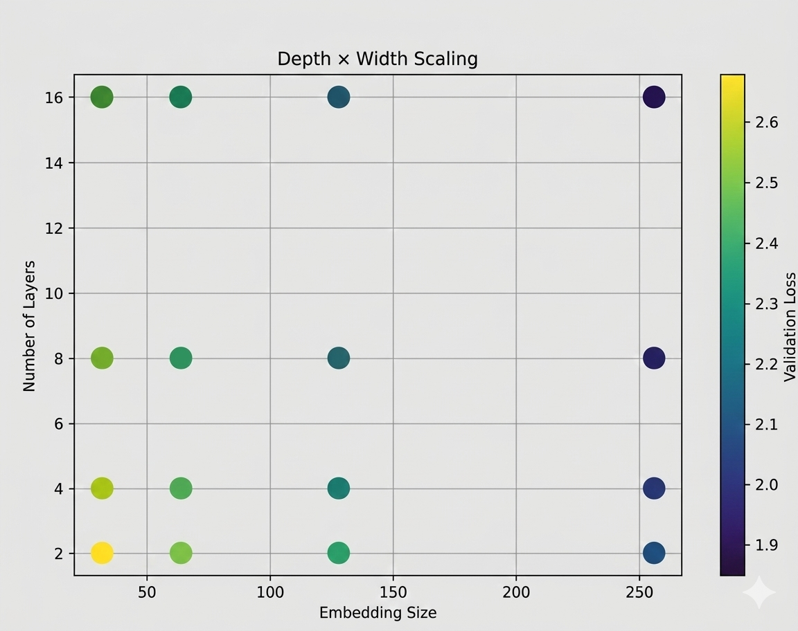

# Experiment 1: Effect of parameter scaling on validation loss

## Experimental Setup

| Component | Details                                                             |
| --------- | ------------------------------------------------------------------- |
| Dataset   | `shakespeare.txt` from `ai_playground/data/datasets/text_datasets/` |
| Model     | MiniGPT-style transformer                                           |
| Config    | [gpt_config.yaml](../../configs/gpt_config.yaml)                    |

> **Objective:** Study the effect of model width (hidden dimension / number of heads) on validation loss.

---

## Steps to reproduce the results

From the experiment folder:

```bash
python -u scaling.py --law [ "width" | "depth" | "depth_width" ]
```

---

**Parameters overridden for the experiment:**

- depth: `model.model_kwargs.n_layer`
- width: `model.model_kwargs.n_embed`, and `model.model_kwargs.hidden_dim`

---

## E1.1 Width vs Validation Loss

In this experiment, we varied the model width by sweeping `n_embed` while keeping other hyperparameters constant.

<figure align="center">
  
  <figcaption><em>Figure 1.1 - Validation loss vs embedding dimension (n_embed).</em></figcaption>
</figure>

### Observations

- **Validation loss decreases with increasing width.**  
  As the embedding dimension (`n_embed`) increases, the model consistently achieves lower validation loss.

- **The trend resembles a reciprocal decay.**  
  The curve is similar to a **rectangular hyperbola**, with rapid improvements at small widths and slower improvements at larger widths.

- **Diminishing returns appear at larger widths.**
  - Small widths show a **rapid drop in validation loss**.
  - Larger widths still improve performance, but the **marginal gain per increase in width becomes smaller**.

- **Compute–performance tradeoff.**  
  Increasing width improves performance, but the **memory and compute cost grow faster than the performance gains** beyond a certain point.

- **Capacity saturation for the dataset.**  
  At sufficiently large widths, the model appears to have enough capacity to capture the dataset patterns, resulting in **smaller improvements in validation loss**.

## E1.2. Depth vs Validation Loss

In this experiment, we varied the model depth by changing the number of layers while keeping other hyperparameters constant.

<figure align="center">
  
  <figcaption><em>Figure 1.2 - Validation loss vs number of layers (n_layer).</em></figcaption>
</figure>

### Observations

- **Validation loss decreases with increasing depth.**  
  As the number of layers increases, the model achieves progressively lower validation loss.

- **Performance gains are more gradual than width scaling.**  
  Compared to increasing model width, scaling depth leads to **smaller improvements per unit increase**, resulting in a smoother and more linear downward trend.

- **Depth scaling alone is less impactful than width scaling.**  
  For this dataset and model configuration, increasing depth improves performance but **does not reduce loss as aggressively as increasing width**.

- **Diminishing returns are still present.**
  - **Early layers provide noticeable improvement**, visible as a steeper initial drop in validation loss.
  - **Later layers yield smaller gains**, suggesting that additional depth contributes progressively less once sufficient representational capacity is reached.

## E1.3 Width and Depth Parameter Sweep vs Validation Loss

In this experiment, we varied **both model width (`n_embed`) and model depth (`n_layer`)** while keeping all other hyperparameters constant. Validation loss was recorded at the end of each training run.

<figure align="center">
  
  <figcaption><em>Figure 1.3 - Validation loss vs number of layers x number of embeddings sweep.</em></figcaption>
</figure>

### Observations

- **Width dominates performance.**  
  There is a clear horizontal trend in the results: increasing the embedding dimension leads to a significantly larger drop in validation loss compared to increasing the number of layers.

- **Depth provides smaller gains.**  
  Increasing the number of layers does improve validation loss, but the effect is noticeably weaker than scaling width.

- **Diminishing returns on depth.**  
  For models with the largest embedding sizes, increasing depth provides little additional improvement, suggesting that model capacity is already sufficient.

- **Shallow models can match deeper ones at large widths.**  
  For large embedding sizes, the validation losses for deeper models are nearly indistinguishable. In particular, results for 8 and 16 layers are almost identical, indicating that additional depth does not meaningfully improve performance for model of this size.

- When compute is constrained, it can be more efficient to **keep depth moderate and allocate more capacity to width**.
